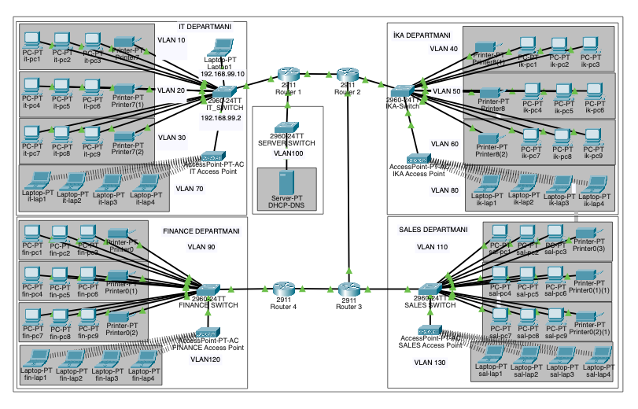

# Enterprise Network Design --- Cisco Packet Tracer

A multi-department enterprise network simulation designed and configured
in Cisco Packet Tracer. The project demonstrates VLAN segmentation,
inter-VLAN routing, centralized DHCP and DNS services, wireless
connectivity, static routing, and dedicated management networks.



## Overview

The network represents a small enterprise environment divided into four
main departments:

-   **IT**
-   **Human Resources (IK/HR)**
-   **Finance**
-   **Sales**

Each department is logically separated using VLANs. Four Cisco 2911
routers provide routing between the different parts of the network,
while Cisco 2960 switches provide Layer 2 connectivity for end devices.

A centralized server at `192.168.100.10` provides DHCP and DNS services
to the network. DHCP relay is implemented with `ip helper-address` where
required so clients in remote VLANs can obtain addresses from the
central server.

## Network Architecture

  Department        Wired VLANs   Wireless VLAN   Management Network
  ----------------- ------------- --------------- --------------------
  IT                10, 20, 30    70              192.168.99.0/24
  Human Resources   40, 50, 60    80              192.168.199.0/24
  Finance           90            120             192.168.200.0/24
  Sales             110           130             192.168.201.0/24

### Server Network

-   **Server VLAN:** 100
-   **DHCP/DNS Server:** `192.168.100.10`
-   **Server Gateway:** `192.168.100.1`

## Routing

The project currently uses static routing between four routers.

### Router Interconnections

  Link                  Network
  --------------------- -------------
  Router 1 ↔ Router 2   10.0.0.0/30
  Router 4 ↔ Router 3   10.0.1.0/30
  Router 3 ↔ Router 2   10.0.2.0/30

Router-on-a-stick is used for inter-VLAN routing. Router subinterfaces
are configured with IEEE 802.1Q encapsulation and act as default
gateways for their corresponding VLANs.

## DHCP and DNS

A centralized server provides network services for multiple departments.

**DHCP** - Central DHCP server architecture - DHCP relay using
`ip helper-address` - Automatic IP configuration for supported client
VLANs - DNS server information distributed to DHCP clients

**DNS** - Central DNS server: `192.168.100.10` - Local `company.local`
records for network infrastructure - Routers and switches configured to
use the central DNS server

## Switching

The switching design includes:

-   Access ports assigned to department VLANs
-   802.1Q trunk links between switches and routers
-   Dedicated management VLAN 99
-   Separate management IP subnet for each routed department
-   PVST spanning tree
-   Wireless access VLANs

## Device Management

Management interfaces are configured on VLAN 99.

  Device           Management IP
  ---------------- ---------------
  IT Switch        192.168.99.2
  HR/IK Switch     192.168.199.2
  Finance Switch   192.168.200.2
  Sales Switch     192.168.201.2

The IT switch also includes local SSH configuration for remote
management. Additional device-hardening and access-control improvements
are planned as the project develops.

## Project Files

``` text
enterprise-network-packet-tracer/
├── enterprise-network.pkt
├── README.md
├── topology.png
└── configs/
    ├── Router-1_router-Ana.txt
    ├── Router-2.txt
    ├── Router-3.txt
    ├── Router-4.txt
    ├── IT-Switch_IT_SWITCH.txt
    ├── HR-IK-Switch_IK_SWITCH.txt
    ├── Finance-Switch.txt
    └── Sales-Switch_SALES_SWITCH.txt
```

The `configs` directory contains the running configurations exported
from all four routers and all four switches.

## Technologies and Concepts

-   Cisco Packet Tracer
-   IPv4 addressing and subnetting
-   VLAN segmentation
-   IEEE 802.1Q trunking
-   Router-on-a-stick
-   Inter-VLAN routing
-   Static routing
-   DHCP
-   DHCP relay
-   DNS
-   Wireless networking
-   Switch management VLANs
-   SSH
-   PVST

## How to Run

1.  Install Cisco Packet Tracer.
2.  Download or clone this repository.
3.  Open `enterprise-network.pkt`.
4.  Allow the topology to converge.
5.  Test connectivity using `ping`, DNS hostnames, and Packet Tracer
    Simulation Mode.
6.  Review the individual device configurations in the `configs`
    directory.

## Testing

The network has been tested for:

-   Communication across routed network segments
-   VLAN gateway reachability
-   DHCP address assignment
-   Central DNS resolution
-   Router-to-router connectivity
-   Remote management network reachability
-   Wireless client connectivity

Packet Tracer's **Simulation Mode** can also be used to inspect ARP,
ICMP, DHCP, DNS, and other packet flows through the topology.

## Future Improvements

Planned improvements include:

-   Extended ACLs for department-level access control
-   SSH management across additional network devices
-   Port Security
-   DHCP Snooping
-   Dynamic routing with OSPF
-   Firewall integration
-   NAT and simulated Internet connectivity
-   Syslog and NTP
-   Additional network monitoring and security controls

## Project Goal

The goal of this project is to develop practical networking skills by
building an enterprise-style network from the ground up and
understanding how switching, routing, VLANs, DHCP, DNS, wireless
networks, and management infrastructure work together.

## Author

**Batuhan Çakmak**\
Computer Engineering Student

This project was designed, configured, tested, and documented as part of
my hands-on learning in computer networking and Cisco technologies.
